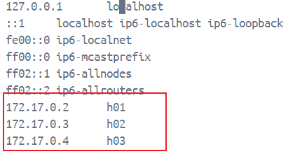

## 2024.12.06   学习大数据

通过docker搭建hadoop集群

#### 安装Docker

第一次在在windows下使用docker，下载docker desktop，需要开启虚拟化，重启生效

#### 创建Hadoop镜像

1.拉取ubuntu镜像

```
#默认拉取的ubuntu最新版
docker pull ubuntu
```

2.创建并启动容器

3.安装Java

4.下载并解压Hadoop

5.修改Hadoop配置文件

6.打包Hadoop Docker镜像

#### 建立Hadoop集群

1.开启三个终端，分别启动 3 个容器

```
docker run -it -h h01 --name h01 -p 9870:9870 -p 8088:8088 hadoop /bin/bash
docker run -it -h h02 --name h02 hadoop /bin/bash
docker run -it -h h03 --name h03 hadoop /bin/bash
```

2.查看当前容器ip

```
cat /etc/hosts
```

3.编辑三个容器的hosts文件，将每个容器的ip保存进去(docker容器启动会重置hosts文件)



4.测试h01是否能够正常连接h02

```
#在h01容器输入
ssh 02
```

5.修改h01的workers文件,将原有的localhost修改为:

```
h02
h03
```

#### 启动Hadoop集群

```
# 第一次第一次启动，务必要format（格式化）一下namenode，后面再启动就不需要format了
hdfs namenode -format
# 启动集群
start-all.sh
```

查看各节点状态

```
jps
```

查看文件系统状态

```
hdfs dfsadmin -report
```

#### 测试Hadoop

1.运行内置 WordCount例子，以LICENSE.txt 作为统计词频的文件

```
cat $HADOOP_HOME/LICENSE.txt > file.txt
```

2.将文件传入Hadoop

```
hadoop fs -ls /
hadoop fs -mkdir /input
hadoop fs -put file.txt /input
hadoop fs -ls /input
```

3.运行hadoop自带的词频统计的例子

```
hadoop jar $HADOOP_HOME/share/hadoop/mapreduce/hadoop-mapreduce-examples-3.4.1.jar wordcount /input /output
```

4.显示结果

```
#查看输出文件名称
hadoop fs -ls /output
#查看文件内容
hadoop fs -cat /output/part-r-00000
```

