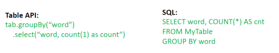

# TableAPI && Flink SQL

TableAPI:一套内嵌在Java和Scala语言中的查询API，它允许我们以非常直观的方式，组合来自一些关系运算符的查询（比如select、filter和join）。

Flink SQL:直接可以在代码中写SQL，来实现一些查询（Query）操作。

无论输入是批输入还是流式输入，在这两套API中，指定的查询都具有相同的语义，得到相同的结果。



### Flink Planner 的作用

负责将用户定义的 SQL 或 Table API 查询转化为执行计划，并将其提交给 Flink 的分布式执行环境。

1. **查询解析**：将 SQL 查询或 Table API 表达式解析为抽象语法树（AST）。
2. **逻辑优化**：对查询进行逻辑上的优化，例如谓词下推、子查询展开等。
3. **物理优化**：根据 Flink 的执行引擎特点生成优化后的物理执行计划。
4. **执行计划生成**：生成可提交到 Flink Runtime 的任务图。

planner类似于mysql中的语法解析器、优化器、执行器

### API

#### 获取环境

```java
// **********************
// FLINK STREAMING QUERY
// **********************
EnvironmentSettings fsSettings = EnvironmentSettings.newInstance().useOldPlanner().inStreamingMode().build();
StreamExecutionEnvironment fsEnv = StreamExecutionEnvironment.getExecutionEnvironment();
StreamTableEnvironment tableEnv = StreamTableEnvironment.create(fsEnv, fsSettings);
// or TableEnvironment tableEnv = TableEnvironment.create(fsSettings);

// ******************
// FLINK BATCH QUERY
// ******************
ExecutionEnvironment fbEnv = ExecutionEnvironment.getExecutionEnvironment();
BatchTableEnvironment tableEnv = BatchTableEnvironment.create(fbEnv);

// **********************
// BLINK STREAMING QUERY
// **********************
StreamExecutionEnvironment bsEnv = StreamExecutionEnvironment.getExecutionEnvironment();
EnvironmentSettings bsSettings = EnvironmentSettings.newInstance().useBlinkPlanner().inStreamingMode().build();
StreamTableEnvironment tableEnv = StreamTableEnvironment.create(bsEnv, bsSettings);
// or TableEnvironment tableEnv = TableEnvironment.create(bsSettings);

// ******************
// BLINK BATCH QUERY
// ******************
EnvironmentSettings bbSettings = EnvironmentSettings.newInstance().useBlinkPlanner().inBatchMode().build();
TableEnvironment tableEnv = TableEnvironment.create(bbSettings);
```

#### 创建表

```
// table is the result of a simple projection query 
Table projTable = tableEnv.from("X").select(...);

// register the Table projTable as table "projectedTable"
tableEnv.createTemporaryView("projectedTable", projTable);
tableEnvironment
  .connect(...)
  .withFormat(...)
  .withSchema(...)
  .inAppendMode()
  .createTemporaryTable("MyTable")
```

#### 查询表

##### Tabel API

```
// register Orders table
// scan registered Orders table
Table orders = tableEnv.from("Orders");// compute revenue for all customers from France
Table revenue = orders
  .filter($("cCountry")
  .isEqual("FRANCE"))
  .groupBy($("cID"), $("cName")
  .select($("cID"), $("cName"), $("revenue")
  .sum()
  .as("revSum"));
// emit or convert Table
// execute query
```

##### SQL

```
// register Orders table
// compute revenue for all customers from France
Table revenue = tableEnv.sqlQuery(
    "SELECT cID, cName, SUM(revenue) AS revSum " +
    "FROM Orders " +
    "WHERE cCountry = 'FRANCE' " +
    "GROUP BY cID, cName"
  );
// emit or convert Table
// execute query

// ######################################################################
// register "Orders" table
// register "RevenueFrance" output table
// compute revenue for all customers from France and emit to "RevenueFrance"
tableEnv.executeSql(
    "INSERT INTO RevenueFrance " +
    "SELECT cID, cName, SUM(revenue) AS revSum " +
    "FROM Orders " +
    "WHERE cCountry = 'FRANCE' " +
    "GROUP BY cID, cName"
  );
```

#### 写出表

```java
// create an output Table
final Schema schema = new Schema()
    .field("a", DataTypes.INT())
    .field("b", DataTypes.STRING())
    .field("c", DataTypes.BIGINT());

tableEnv.connect(new FileSystem().path("/path/to/file"))
    .withFormat(new Csv().fieldDelimiter('|').deriveSchema())
    .withSchema(schema)
    .createTemporaryTable("CsvSinkTable");
// compute a result Table using Table API operators and/or SQL queries
Table result = ...
// emit the result Table to the registered TableSink
result.executeInsert("CsvSinkTable");
```

#### 与DataSet/DataStream集成

##### DataStream创建视图

```java
// see "Create a TableEnvironment" section
DataStream<Tuple2<Long, String>> stream = ...

// register the DataStream as View "myTable" with fields "f0", "f1"
tableEnv.createTemporaryView("myTable", stream);

// register the DataStream as View "myTable2" with fields "myLong", "myString"
tableEnv.createTemporaryView("myTable2", stream, $("myLong"), $("myString"));
```

##### DataStream-->表

```java
// see "Create a TableEnvironment" section
DataStream<Tuple2<Long, String>> stream = ...
// Convert the DataStream into a Table with default fields "f0", "f1"

Table table1 = tableEnv.fromDataStream(stream);
// Convert the DataStream into a Table with fields "myLong", "myString"
Table table2 = tableEnv.fromDataStream(stream, $("myLong"), $("myString"));
```

##### 表-->DataStream

```java
// Table with two fields (String name, Integer age)
Table table = ...

//将表转换为追加模式的流，指定目标流的数据类型为Row
DataStream<Row> dsRow = tableEnv.toAppendStream(table, Row.class);

TupleTypeInfo<Tuple2<String, Integer>> tupleType = new TupleTypeInfo<>(
  Types.STRING(),
  Types.INT());
//将表转换为追加模式的流，指定目标流的数据类型为tupleType
DataStream<Tuple2<String, Integer>> dsTuple = 
  tableEnv.toAppendStream(table, tupleType);

//将表转换为撤回模式的流，指定目标流的数据类型为Row
DataStream<Tuple2<Boolean, Row>> retractStream = 
  tableEnv.toRetractStream(table, Row.class);
```

##### 表-->DataSet

```java
// Table with two fields (String name, Integer age)
Table table = ...

// convert the Table into a DataSet of Row by specifying a class
DataSet<Row> dsRow = tableEnv.toDataSet(table, Row.class);

TypeInformationTupleTypeInfo<Tuple2<String, Integer>> tupleType = 
    new TupleTypeInfo<>(Types.STRING(),Types.INT());
DataSet<Tuple2<String, Integer>> dsTuple = 
  tableEnv.toDataSet(table, tupleType);
```

### Flink SQL算子

相比于mysql，多了window算子

### Demo1

将DataStream注册为Table和View并进行SQL统计

```
package com.hzy.sql;

import lombok.AllArgsConstructor;
import lombok.Data;
import lombok.NoArgsConstructor;
import org.apache.flink.streaming.api.datastream.DataStream;
import org.apache.flink.streaming.api.environment.StreamExecutionEnvironment;
import org.apache.flink.table.api.Table;
import org.apache.flink.table.api.bridge.java.StreamTableEnvironment;

import java.util.Arrays;

import static org.apache.flink.table.api.Expressions.$;

public class SQLDemo1 {
    public static void main(String[] args) throws Exception {
        //1.准备环境
        StreamExecutionEnvironment env = StreamExecutionEnvironment.getExecutionEnvironment();
        env.setParallelism(1);
        StreamTableEnvironment tEnv = StreamTableEnvironment.create(env);

        //2.Source
        DataStream<Order> orderA = env.fromCollection(Arrays.asList(
                new Order(1L, "beer", 3),
                new Order(1L, "diaper", 4),
                new Order(3L, "rubber", 2)));

        DataStream<Order> orderB = env.fromCollection(Arrays.asList(
                new Order(2L, "pen", 3),
                new Order(2L, "rubber", 3),
                new Order(4L, "beer", 1)));

        //3.注册表
        // convert DataStream to Table
        Table tableA = tEnv.fromDataStream(orderA, $("user"), $("product"), $("amount"));
        // register DataStream as Table
        tEnv.createTemporaryView("OrderB", orderB, $("user"), $("product"), $("amount"));

        //4.执行查询
        System.out.println(tableA);
        // union the two tables
        Table resultTable = tEnv.sqlQuery(
                "SELECT * FROM " + tableA + " WHERE amount > 2 " +
                        "UNION ALL " +
                        "SELECT * FROM OrderB WHERE amount < 2"
        );

        //5.输出结果
        DataStream<Order> resultDS = tEnv.toAppendStream(resultTable, Order.class);
        resultDS.print();

        env.execute();
    }

    @Data
    @NoArgsConstructor
    @AllArgsConstructor
    public static class Order {
        public Long user;
        public String product;
        public int amount;
    }
}
```

### Demo2

使用Flink SQL来统计5秒内 每个用户的 订单总数、订单的最大金额、订单的最小金额

```
package com.hzy.sql;

import lombok.AllArgsConstructor;
import lombok.Data;
import lombok.NoArgsConstructor;
import org.apache.flink.api.common.eventtime.WatermarkStrategy;
import org.apache.flink.api.java.tuple.Tuple2;
import org.apache.flink.streaming.api.datastream.DataStream;
import org.apache.flink.streaming.api.datastream.DataStreamSource;
import org.apache.flink.streaming.api.environment.StreamExecutionEnvironment;
import org.apache.flink.streaming.api.functions.source.RichSourceFunction;
import org.apache.flink.table.api.Table;
import org.apache.flink.table.api.Tumble;
import org.apache.flink.table.api.bridge.java.StreamTableEnvironment;
import org.apache.flink.types.Row;

import java.time.Duration;
import java.util.Random;
import java.util.UUID;
import java.util.concurrent.TimeUnit;

import static org.apache.flink.table.api.Expressions.$;
import static org.apache.flink.table.api.Expressions.lit;

public class SQLDemo2 {
    public static void main(String[] args) throws Exception {
        //1.准备环境
        StreamExecutionEnvironment env = StreamExecutionEnvironment.getExecutionEnvironment();
        StreamTableEnvironment tEnv = StreamTableEnvironment.create(env);

        //2.Source
        DataStreamSource<Order> orderDS  = env.addSource(new RichSourceFunction<Order>() {
            private Boolean isRunning = true;
            @Override
            public void run(SourceContext<Order> ctx) throws Exception {
                Random random = new Random();
                while (isRunning) {
                    Order order = new Order(UUID.randomUUID().toString(), random.nextInt(3), random.nextInt(101), System.currentTimeMillis());
                    TimeUnit.SECONDS.sleep(1);
                    ctx.collect(order);
                }
            }

            @Override
            public void cancel() {
                isRunning = false;
            }
        });

        //3.Transformation
        DataStream<Order> watermakerDS = orderDS
                .assignTimestampsAndWatermarks(
                        WatermarkStrategy.<Order>forBoundedOutOfOrderness(Duration.ofSeconds(2))
                                .withTimestampAssigner((event, timestamp) -> event.getCreateTime())
                );

        //4.注册表
        tEnv.createTemporaryView("t_order", watermakerDS,
                $("orderId"), $("userId"), $("money"), $("createTime").rowtime());

        //5.执行SQL
        //5.1 Flink SQL
//        String sql = "select " +
//                "userId," +
//                "count(*) as totalCount," +
//                "max(money) as maxMoney," +
//                "min(money) as minMoney " +
//                "from t_order " +
//                "group by userId," +
//                "tumble(createTime, interval '5' second)";
//
//        Table ResultTable = tEnv.sqlQuery(sql);

        //Table API

        tEnv.from("t_order").printSchema();

        Table ResultTable = tEnv.from("t_order")
                .window(Tumble.over(lit(5).second())
                        .on($("createTime"))
                        .as("tumbleWindow"))
                .groupBy($("tumbleWindow"), $("userId"))
                .select($("userId"),
                        $("userId").count().as("totalCount"),
                        $("money").max().as("maxMoney"),
                        $("money").min().as("minMoney"));

        //6.Sink
        //将SQL的执行结果转换成DataStream再打印出来
        //toAppendStream * 将计算后的数据append到结果DataStream中去
        //toRetractStream  * 将计算后的新的数据在DataStream原数据的基础上更新true或是删除false
        DataStream<Tuple2<Boolean, Row>> res = tEnv.toRetractStream(ResultTable, Row.class);

//        DataStream<Row> res = tEnv.toAppendStream(ResultTable, Row.class);
        res.print();
        env.execute();

    }

    @Data
    @AllArgsConstructor
    @NoArgsConstructor
    public static class Order {
        private String orderId;
        private Integer userId;
        private Integer money;
        private Long createTime;
    }
}
```

### Demo3

在订单完成之后，一定时间之内没有做出评价，系统自动给与五星好评

```
package com.hzy.sql;


import org.apache.flink.api.common.state.MapState;
import org.apache.flink.api.common.state.MapStateDescriptor;
import org.apache.flink.api.java.tuple.Tuple;
import org.apache.flink.api.java.tuple.Tuple3;
import org.apache.flink.configuration.Configuration;
import org.apache.flink.streaming.api.datastream.DataStreamSource;
import org.apache.flink.streaming.api.environment.StreamExecutionEnvironment;
import org.apache.flink.streaming.api.functions.KeyedProcessFunction;
import org.apache.flink.streaming.api.functions.source.SourceFunction;
import org.apache.flink.util.Collector;

import java.util.Iterator;
import java.util.Map;
import java.util.Random;
import java.util.UUID;

/**

 * 在电商领域会有这么一个场景，如果用户买了商品，在订单完成之后，一定时间之内没有做出评价，系统自动给与五星好评，
 * 我们今天主要使用Flink的定时器来简单实现这一功能。
 */
public class SQLDemo3 {
    public static void main(String[] args) throws Exception {
        //1.env
        StreamExecutionEnvironment env = StreamExecutionEnvironment.getExecutionEnvironment();
        env.setParallelism(1);
        //2.source
        DataStreamSource<Tuple3<String, String, Long>> sourceDS = env.addSource(new MySource());
        //这里可以使用订单生成时间作为事件时间,代码和之前的一样
        //这里不作为重点,所以简化处理!

        //3.transformation
        //设置经过interval用户未对订单做出评价，自动给与好评.为了演示方便，设置5000ms的时间
        long interval = 5000L;
        //分组后使用自定义KeyedProcessFunction完成定时判断超时订单并自动好评
        sourceDS.keyBy(0) //实际中可以对用户id进行分组
                //KeyedProcessFunction:进到窗口的数据是分好组的
                //ProcessFunction:进到窗口的数据是不区分分组的
                .process(new TimerProcessFuntion(interval));
        //4.execute
        env.execute();
    }

    /**
     * 自定义source实时产生订单数据Tuple2<订单id, 订单生成时间>
     */
    public static class MySource implements SourceFunction<Tuple3<String, String, Long>> {
        private boolean flag = true;
        @Override
        public void run(SourceContext<Tuple3<String, String, Long>> ctx) throws Exception {
            Random random = new Random();
            while (flag) {
                String userId = random.nextInt(5) + "";
                String orderId = UUID.randomUUID().toString();
                long currentTimeMillis = System.currentTimeMillis();
                ctx.collect(Tuple3.of(userId, orderId, currentTimeMillis));
                Thread.sleep(500);
            }
        }

        @Override
        public void cancel() {
            flag = false;
        }
    }

    /**
     * 自定义处理函数用来给超时订单做自动好评!
     * 如一个订单进来:<订单id, 2020-10-10 12:00:00>
     * 那么该订单应该在12:00:00 + 5s 的时候超时!
     * 所以我们可以在订单进来的时候设置一个定时器,在订单时间 + interval的时候触发!
     * KeyedProcessFunction<K, I, O>
     * KeyedProcessFunction<Tuple就是String, Tuple3<用户id, 订单id, 订单生成时间>, Object>
     */
    public static class TimerProcessFuntion extends KeyedProcessFunction<Tuple, Tuple3<String, String, Long>, Object> {
        private long interval;

        public TimerProcessFuntion(long interval) {
            this.interval = interval;//传过来的是5000ms/5s
        }

        //3.1定义MapState类型的状态，key是订单号，value是订单完成时间
        //定义一个状态用来记录订单信息
        //MapState<订单id, 订单完成时间>
        private MapState<String, Long> mapState;

        //3.2初始化MapState
        @Override
        public void open(Configuration parameters) throws Exception {
            //创建状态描述器
            MapStateDescriptor<String, Long> mapStateDesc = new MapStateDescriptor<>("mapState", String.class, Long.class);
            //根据状态描述器初始化状态
            mapState = getRuntimeContext().getMapState(mapStateDesc);
        }
        //3.3注册定时器
        //处理每一个订单并设置定时器
        @Override
        public void processElement(Tuple3<String, String, Long> value, Context ctx, Collector<Object> out) throws Exception {
            mapState.put(value.f1, value.f2);
            //如一个订单进来:<订单id, 2020-10-10 12:00:00>
            //那么该订单应该在12:00:00 + 5s 的时候超时!
            //在订单进来的时候设置一个定时器,在订单时间 + interval的时候触发!!!
            ctx.timerService().registerProcessingTimeTimer(value.f2 + interval);
        }

        //3.4定时器被触发时执行并输出结果并sink
        @Override
        public void onTimer(long timestamp, OnTimerContext ctx, Collector<Object> out) throws Exception {
            //能够执行到这里说明订单超时了!超时了得去看看订单是否评价了(实际中应该要调用外部接口/方法查订单系统!,我们这里没有,所以模拟一下)
            //没有评价才给默认好评!并直接输出提示!
            //已经评价了,直接输出提示!
            Iterator<Map.Entry<String, Long>> iterator = mapState.iterator();
            while (iterator.hasNext()) {
                Map.Entry<String, Long> entry = iterator.next();
                String orderId = entry.getKey();
                //调用订单系统查询是否已经评价
                boolean result = isEvaluation(orderId);
                if (result) {//已评价
                    System.out.println("订单(orderid: " + orderId + ")在" + interval + "毫秒时间内已经评价，不做处理");
                } else {//未评价
                    System.out.println("订单(orderid: " + orderId + ")在" + interval + "毫秒时间内未评价，系统自动给了默认好评!");
                    //实际中还需要调用订单系统将该订单orderId设置为5星好评!
                }
                //从状态中移除已经处理过的订单,避免重复处理
                iterator.remove();
            }
        }

        //在生产环境下，可以去查询相关的订单系统.
        private boolean isEvaluation(String key) {
            return key.hashCode() % 2 == 0;//随机返回订单是否已评价
        }
    }
}
```
