# Flink 高级特性

## 广播状态

在开发过程中，如果遇到需要下发/广播配置、规则等低吞吐事件流到下游所有 task 时，就可以使用 Broadcast State。下游的task 接收这些配置、规则并保存为 BroadcastState, 将这些配置应用到另一个数据流的计算中 。

### 场景举例

1. 动态更新计算规则: 如事件流需要根据最新的规则进行计算，则可将规则作为广播状态广播到下游Task中。
2. 实时增加额外字段: 如事件流需要实时增加用户的基础信息，则可将用户的基础信息作为广播状态广播到下游Task中。

### API介绍

首先创建一个Keyed 或Non-Keyed 的DataStream，然后再创建一个BroadcastedStream，最后通过DataStream来连接(调用connect 方法)到Broadcasted Stream 上，这样实现将BroadcastState广播到Data Stream 下游的每个Task中。

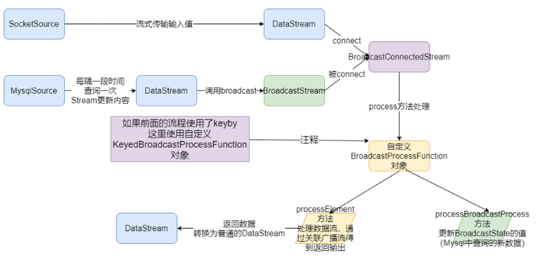

### 编码步骤

```java
//编码步骤

1.	env

2.	source
    2.1. 构建实时数据事件流-自定义随机
        <userID, eventTime, eventType, productID>
    2.2.构建配置流-从MySQL
        <用户id,<姓名,年龄>>

3.	transformation
    3.1. 定义状态描述器
        MapStateDescriptor<Void, Map<String, Tuple2<String, Integer>>> descriptor =
        new MapStateDescriptor<>("config",Types.VOID, Types.MAP(Types.STRING, Types.TUPLE(Types.STRING, Types.INT)));
    3.2. 广播配置流
        BroadcastStream<Map<String, Tuple2<String, Integer>>> broadcastDS = configDS.broadcast(descriptor);
    3.3. 将事件流和广播流进行连接
        BroadcastConnectedStream<Tuple4<String, String, String, Integer>, Map<String, Tuple2<String, Integer>>> connectDS =eventDS.connect(broadcastDS);
    3.4. 处理连接后的流-根据配置流补全事件流中的用户的信息

4.	sink

5.	execute
```

### 代码实现

```java
package com.hzy.advfeatures;

import org.apache.flink.api.common.state.BroadcastState;
import org.apache.flink.api.common.state.MapStateDescriptor;
import org.apache.flink.api.common.state.ReadOnlyBroadcastState;
import org.apache.flink.api.common.typeinfo.Types;
import org.apache.flink.api.java.tuple.Tuple2;
import org.apache.flink.api.java.tuple.Tuple4;
import org.apache.flink.api.java.tuple.Tuple6;
import org.apache.flink.configuration.Configuration;
import org.apache.flink.streaming.api.datastream.BroadcastConnectedStream;
import org.apache.flink.streaming.api.datastream.BroadcastStream;
import org.apache.flink.streaming.api.datastream.DataStreamSource;
import org.apache.flink.streaming.api.datastream.SingleOutputStreamOperator;
import org.apache.flink.streaming.api.environment.StreamExecutionEnvironment;
import org.apache.flink.streaming.api.functions.co.BroadcastProcessFunction;
import org.apache.flink.streaming.api.functions.source.RichSourceFunction;
import org.apache.flink.streaming.api.functions.source.SourceFunction;
import org.apache.flink.util.Collector;

import java.sql.Connection;
import java.sql.DriverManager;
import java.sql.PreparedStatement;
import java.sql.ResultSet;
import java.text.SimpleDateFormat;
import java.util.Date;
import java.util.HashMap;
import java.util.Map;
import java.util.Random;

/**
 * Desc
 * 需求:
 * 使用Flink的BroadcastState来完成
 * 事件流和配置流(需要广播为State)的关联,并实现配置的动态更新!
 */
public class BroadcastStateConfigUpdate {
    public static void main(String[] args) throws Exception{
        //1.env
        StreamExecutionEnvironment env = StreamExecutionEnvironment.getExecutionEnvironment();
        //2.source
        //-1.构建实时的自定义随机数据事件流-数据源源不断产生,量会很大
        //<userID, eventTime, eventType, productID>
        DataStreamSource<Tuple4<String, String, String, Integer>> eventDS = env.addSource(new MySource());

        //-2.构建配置流-从MySQL定期查询最新的,数据量较小
        //<用户id,<姓名,年龄>>
        DataStreamSource<Map<String, Tuple2<String, Integer>>> configDS = env.addSource(new MySQLSource());

        //3.transformation
        //-1.定义状态描述器-准备将配置流作为状态广播
        MapStateDescriptor<Void, Map<String, Tuple2<String, Integer>>> descriptor =
                new MapStateDescriptor<>("config", Types.VOID, Types.MAP(Types.STRING, Types.TUPLE(Types.STRING, Types.INT)));
        //-2.将配置流根据状态描述器广播出去,变成广播状态流
        BroadcastStream<Map<String, Tuple2<String, Integer>>> broadcastDS = configDS.broadcast(descriptor);

        //-3.将事件流和广播流进行连接
        BroadcastConnectedStream<Tuple4<String, String, String, Integer>, Map<String, Tuple2<String, Integer>>> connectDS =eventDS.connect(broadcastDS);
        //-4.处理连接后的流-根据配置流补全事件流中的用户的信息
        SingleOutputStreamOperator<Tuple6<String, String, String, Integer, String, Integer>> result = connectDS
                //BroadcastProcessFunction<IN1, IN2, OUT>
                .process(new BroadcastProcessFunction<
                        //<userID, eventTime, eventType, productID> //事件流
                        Tuple4<String, String, String, Integer>,
                        //<用户id,<姓名,年龄>> //广播流
                        Map<String, Tuple2<String, Integer>>,
                        //<用户id，eventTime，eventType，productID，姓名，年龄> //需要收集的数据
                        Tuple6<String, String, String, Integer, String, Integer>>() {

                    //处理事件流中的元素
                    @Override
                    public void processElement(Tuple4<String, String, String, Integer> value, ReadOnlyContext ctx, Collector<Tuple6<String, String, String, Integer, String, Integer>> out) throws Exception {
                        //取出事件流中的userId
                        String userId = value.f0;
                        //根据状态描述器获取广播状态
                        ReadOnlyBroadcastState<Void, Map<String, Tuple2<String, Integer>>> broadcastState = ctx.getBroadcastState(descriptor);
                        if (broadcastState != null) {
                            //取出广播状态中的map<用户id,<姓名,年龄>>
                            Map<String, Tuple2<String, Integer>> map = broadcastState.get(null);
                            if (map != null) {
                                //通过userId取map中的<姓名,年龄>
                                Tuple2<String, Integer> tuple2 = map.get(userId);
                                //取出tuple2中的姓名和年龄
                                String userName = tuple2.f0;
                                Integer userAge = tuple2.f1;
                                out.collect(Tuple6.of(userId, value.f1, value.f2, value.f3, userName, userAge));
                            }
                        }
                    }

                    //处理广播流中的元素
                    @Override
                    public void processBroadcastElement(Map<String, Tuple2<String, Integer>> value, Context ctx, Collector<Tuple6<String, String, String, Integer, String, Integer>> out) throws Exception {
                        //value就是MySQLSource中每隔一段时间获取到的最新的map数据
                        //先根据状态描述器获取历史的广播状态
                        BroadcastState<Void, Map<String, Tuple2<String, Integer>>> broadcastState = ctx.getBroadcastState(descriptor);
                        //再清空历史状态数据
                        broadcastState.clear();
                        //最后将最新的广播流数据放到state中（更新状态数据）
                        broadcastState.put(null, value);
                    }
                });
        //4.sink
        result.print();
        //5.execute
        env.execute();
    }

    /**
     * <userID, eventTime, eventType, productID>
     */
    public static class MySource implements SourceFunction<Tuple4<String, String, String, Integer>>{
        private boolean isRunning = true;
        @Override
        public void run(SourceContext<Tuple4<String, String, String, Integer>> ctx) throws Exception {
            Random random = new Random();
            SimpleDateFormat df = new SimpleDateFormat("yyyy-MM-dd HH:mm:ss");
            while (isRunning){
                int id = random.nextInt(4) + 1;
                String user_id = "user_" + id;
                String eventTime = df.format(new Date());
                String eventType = "type_" + random.nextInt(3);
                int productId = random.nextInt(4);
                ctx.collect(Tuple4.of(user_id,eventTime,eventType,productId));
                Thread.sleep(500);
            }
        }

        @Override
        public void cancel() {
            isRunning = false;
        }
    }
    /**
     * <用户id,<姓名,年龄>>
     */
    public static class MySQLSource extends RichSourceFunction<Map<String, Tuple2<String, Integer>>> {
        private boolean flag = true;
        private Connection conn = null;
        private PreparedStatement ps = null;
        private ResultSet rs = null;

        @Override
        public void open(Configuration parameters) throws Exception {
            conn = DriverManager.getConnection("jdbc:mysql://localhost:3306/flink", "root", "123456");
            String sql = "select userID, userName, userAge from user_info";
            ps = conn.prepareStatement(sql);
        }
        @Override
        public void run(SourceContext<Map<String, Tuple2<String, Integer>>> ctx) throws Exception {
            while (flag){
                Map<String, Tuple2<String, Integer>> map = new HashMap<>();
                ResultSet rs = ps.executeQuery();
                while (rs.next()){
                    String userID = rs.getString("userID");
                    String userName = rs.getString("userName");
                    int userAge = rs.getInt("userAge");
                    //Map<String, Tuple2<String, Integer>>
                    map.put(userID,Tuple2.of(userName,userAge));
                }
                ctx.collect(map);
                Thread.sleep(5000);//每隔5s更新一下用户的配置信息!
            }
        }
        @Override
        public void cancel() {
            flag = false;
        }
        @Override
        public void close() throws Exception {
            if (conn != null) conn.close();
            if (ps != null) ps.close();
            if (rs != null) rs.close();
        }
    }
}
```

## 双流Join

Join大体分类只有两种：Window Join和Interval Join。

- Window Join又可以根据Window的类型细分出3种：Tumbling Window Join、Sliding Window Join、Session Widnow Join。Windows类型的join都是利用window的机制，先将数据缓存在Window State中，当窗口触发计算时，执行join操作；
- interval join也是利用state存储数据再处理，区别在于state中的数据有失效机制，依靠数据触发数据清理；

### Window Join

#### Tumbling Window Join

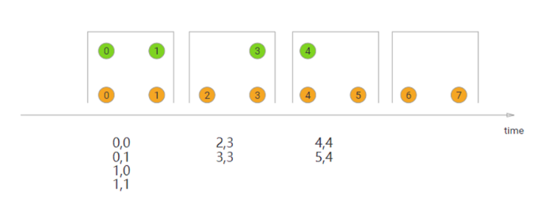

```java
DataStream<Integer> orangeStream = ...
DataStream<Integer> greenStream = ...
orangeStream.join(greenStream)
    .where(<KeySelector>)
    .equalTo(<KeySelector>)
    .window(TumblingEventTimeWindows.of(Time.milliseconds(2)))
    .apply (new JoinFunction<Integer, Integer, String> (){
        @Override
        public String join(Integer first, Integer second) {
            return first + "," + second;
        }
    });
```

#### Sliding Window Join

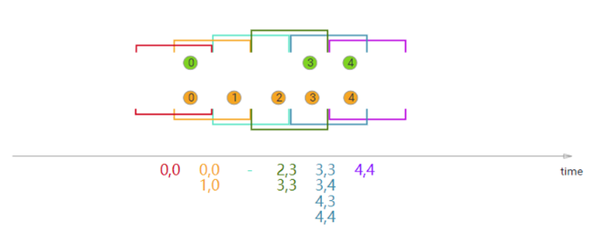

```java
DataStream<Integer> orangeStream = ...
DataStream<Integer> greenStream = ...
orangeStream.join(greenStream)
    .where(<KeySelector>)
    .equalTo(<KeySelector>)
    .window(SlidingEventTimeWindows.of(Time.milliseconds(2) /* size */, Time.milliseconds(1) /* slide */))
    .apply (new JoinFunction<Integer, Integer, String> (){
        @Override
        public String join(Integer first, Integer second) {
            return first + "," + second;
        }
    });
```

#### Session Window Join

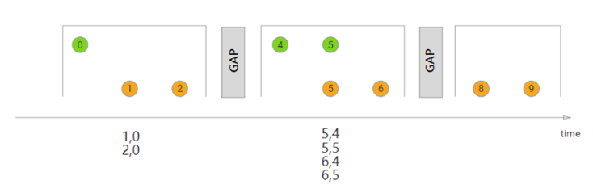

```java
DataStream<Integer> orangeStream = ...
DataStream<Integer> greenStream = ...
orangeStream.join(greenStream)
    .where(<KeySelector>)
    .equalTo(<KeySelector>)
    .window(EventTimeSessionWindows.withGap(Time.milliseconds(1)))
    .apply (new JoinFunction<Integer, Integer, String> (){
        @Override
        public String join(Integer first, Integer second) {
            return first + "," + second;
        }
    });
```

### Interval Join

Window Join必须要在一个Window中进行JOIN，interval join使用相同的key来join两个流（流A、流B），并且流B中的元素中的时间戳，和流A元素的时间戳，有一个时间间隔。

```java
//流B的元素的时间戳 ≥ 流A的元素时间戳 + 下界，且，流B的元素的时间戳 ≤ 流A的元素时间戳 + 上界。
b.timestamp ∈ [a.timestamp + lowerBound; a.timestamp + upperBound]*
or*
a.timestamp + lowerBound <= b.timestamp <= a.timestamp + upperBound
```

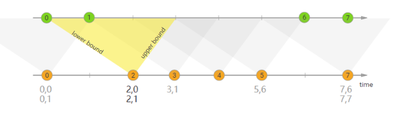

```java
//将两个流“orange”和“green”连接起来，其下限为-2毫秒，上限为+1毫秒。
DataStream<Integer> orangeStream = ...
DataStream<Integer> greenStream = ...
orangeStream
    .keyBy(<KeySelector>)
    .intervalJoin(greenStream.keyBy(<KeySelector>))
    .between(Time.milliseconds(-2), Time.milliseconds(1))
    .process (new ProcessJoinFunction<Integer, Integer, String(){

        @Override
        public void processElement(Integer left, Integer right, Context ctx, Collector<String> out) {
            out.collect(first + "," + second);
        }
    });
```

### Demo1

#### 需求

使用两个指定Source模拟数据，一个Source是订单明细，一个Source是商品数据。通过window join，将数据关联到一起。

#### 思路

1、Window Join首先需要使用where和equalTo指定使用哪个key来进行关联，此处我们通过应用方法，基于GoodsId来关联两个流中的元素。

2、设置5秒的滚动窗口，流的元素关联都会在这个5秒的窗口中进行关联。

3、apply方法中实现将两个不同类型的元素关联并生成一个新类型的元素。

#### 代码实现

```java
package com.hzy.advfeatures;

import com.alibaba.fastjson.JSON;
import lombok.Data;
import org.apache.flink.api.common.eventtime.*;
import org.apache.flink.api.common.typeinfo.TypeInformation;
import org.apache.flink.configuration.Configuration;
import org.apache.flink.streaming.api.datastream.DataStream;
import org.apache.flink.streaming.api.environment.StreamExecutionEnvironment;
import org.apache.flink.streaming.api.functions.source.RichSourceFunction;
import org.apache.flink.streaming.api.windowing.assigners.TumblingEventTimeWindows;
import org.apache.flink.streaming.api.windowing.time.Time;

import java.math.BigDecimal;
import java.util.ArrayList;
import java.util.List;
import java.util.Random;
import java.util.UUID;
import java.util.concurrent.TimeUnit;

public class JoinDemo1 {
    public static void main(String[] args) throws Exception {
        StreamExecutionEnvironment env = StreamExecutionEnvironment.getExecutionEnvironment();

        // 构建商品数据流
        DataStream<Goods> goodsDS = env.addSource(new GoodsSource11(), TypeInformation.of(Goods.class)).assignTimestampsAndWatermarks(new GoodsWatermark());
        // 构建订单明细数据流
        DataStream<OrderItem> orderItemDS = env.addSource(new OrderItemSource(), TypeInformation.of(OrderItem.class)).assignTimestampsAndWatermarks(new OrderItemWatermark());

        // 进行关联查询
        DataStream<FactOrderItem> factOrderItemDS = orderItemDS.join(goodsDS)
                // 第一个流orderItemDS
                .where(OrderItem::getGoodsId)
                // 第二流goodsDS
                .equalTo(Goods::getGoodsId)
                .window(TumblingEventTimeWindows.of(Time.seconds(5)))
                .apply((OrderItem item, Goods goods) -> {
                    FactOrderItem factOrderItem = new FactOrderItem();
                    factOrderItem.setGoodsId(goods.getGoodsId());
                    factOrderItem.setGoodsName(goods.getGoodsName());
                    factOrderItem.setCount(new BigDecimal(item.getCount()));
                    factOrderItem.setTotalMoney(goods.getGoodsPrice().multiply(new BigDecimal(item.getCount())));
                    return factOrderItem;
                });

        factOrderItemDS.print();

        env.execute("滚动窗口JOIN");
    }
    //商品类
    @Data
    public static class Goods {
        private String goodsId;
        private String goodsName;
        private BigDecimal goodsPrice;

        public static List<Goods> GOODS_LIST;
        public static Random r;

        static  {
            r = new Random();
            GOODS_LIST = new ArrayList<>();
            GOODS_LIST.add(new Goods("1", "小米12", new BigDecimal(4890)));
            GOODS_LIST.add(new Goods("2", "iphone12", new BigDecimal(12000)));
            GOODS_LIST.add(new Goods("3", "MacBookPro", new BigDecimal(15000)));
            GOODS_LIST.add(new Goods("4", "Thinkpad X1", new BigDecimal(9800)));
            GOODS_LIST.add(new Goods("5", "MeiZu One", new BigDecimal(3200)));
            GOODS_LIST.add(new Goods("6", "Mate 40", new BigDecimal(6500)));
        }

        public static Goods randomGoods() {
            int rIndex = r.nextInt(GOODS_LIST.size());
            return GOODS_LIST.get(rIndex);
        }

        public Goods() {
        }

        public Goods(String goodsId, String goodsName, BigDecimal goodsPrice) {
            this.goodsId = goodsId;
            this.goodsName = goodsName;
            this.goodsPrice = goodsPrice;
        }

        @Override
        public String toString() {
            return JSON.toJSONString(this);
        }
    }

    //订单明细类
    @Data
    public static class OrderItem {
        private String itemId;
        private String goodsId;
        private Integer count;

        @Override
        public String toString() {
            return JSON.toJSONString(this);
        }
    }

    //关联结果
    @Data
    public static class FactOrderItem {
        private String goodsId;
        private String goodsName;
        private BigDecimal count;
        private BigDecimal totalMoney;
        @Override
        public String toString() {
            return JSON.toJSONString(this);
        }
    }
    //构建一个商品Stream源（这个好比就是维表）
    public static class GoodsSource11 extends RichSourceFunction {
        private Boolean isCancel;
        @Override
        public void open(Configuration parameters) throws Exception {
            isCancel = false;
        }
        @Override
        public void run(SourceContext sourceContext) throws Exception {
            while(!isCancel) {
                Goods.GOODS_LIST.stream().forEach(goods -> sourceContext.collect(goods));
                TimeUnit.SECONDS.sleep(1);
            }
        }
        @Override
        public void cancel() {
            isCancel = true;
        }
    }
    //构建订单明细Stream源
    public static class OrderItemSource extends RichSourceFunction {
        private Boolean isCancel;
        private Random r;
        @Override
        public void open(Configuration parameters) throws Exception {
            isCancel = false;
            r = new Random();
        }
        @Override
        public void run(SourceContext sourceContext) throws Exception {
            while(!isCancel) {
                Goods goods = Goods.randomGoods();
                OrderItem orderItem = new OrderItem();
                orderItem.setGoodsId(goods.getGoodsId());
                orderItem.setCount(r.nextInt(10) + 1);
                orderItem.setItemId(UUID.randomUUID().toString());
                sourceContext.collect(orderItem);
                orderItem.setGoodsId("111");
                sourceContext.collect(orderItem);
                TimeUnit.SECONDS.sleep(1);
            }
        }

        @Override
        public void cancel() {
            isCancel = true;
        }
    }
    //构建水印分配器（此处为了简单），直接使用系统时间了
    public static class GoodsWatermark implements WatermarkStrategy<Goods> {

        @Override
        public TimestampAssigner<Goods> createTimestampAssigner(TimestampAssignerSupplier.Context context) {
            return (element, recordTimestamp) -> System.currentTimeMillis();
        }

        @Override
        public WatermarkGenerator<Goods> createWatermarkGenerator(WatermarkGeneratorSupplier.Context context) {
            return new WatermarkGenerator<Goods>() {
                @Override
                public void onEvent(Goods event, long eventTimestamp, WatermarkOutput output) {
                    output.emitWatermark(new Watermark(System.currentTimeMillis()));
                }

                @Override
                public void onPeriodicEmit(WatermarkOutput output) {
                    output.emitWatermark(new Watermark(System.currentTimeMillis()));
                }
            };
        }
    }

    public static class OrderItemWatermark implements WatermarkStrategy<OrderItem> {
        @Override
        public TimestampAssigner<OrderItem> createTimestampAssigner(TimestampAssignerSupplier.Context context) {
            return (element, recordTimestamp) -> System.currentTimeMillis();
        }
        @Override
        public WatermarkGenerator<OrderItem> createWatermarkGenerator(WatermarkGeneratorSupplier.Context context) {
            return new WatermarkGenerator<OrderItem>() {
                @Override
                public void onEvent(OrderItem event, long eventTimestamp, WatermarkOutput output) {
                    output.emitWatermark(new Watermark(System.currentTimeMillis()));
                }
                @Override
                public void onPeriodicEmit(WatermarkOutput output) {
                    output.emitWatermark(new Watermark(System.currentTimeMillis()));
                }
            };
        }
    }
}
```

### Demo2

#### 需求

使用两个指定Source模拟数据，一个Source是订单明细，一个Source是商品数据。通过interval join，将数据关联到一起。

#### 思路

1、通过keyBy将两个流join到一起

2、interval join需要设置流A去关联哪个时间范围的流B中的元素。此处，我设置的下界为-1、上界为0，且上界是一个开区间。表达的意思就是流A中某个元素的时间，对应上一秒的流B中的元素。

3、process中将两个key一样的元素，关联在一起，并加载到一个新的FactOrderItem对象中

#### 代码实现

```java
package com.hzy.advfeatures;

import com.alibaba.fastjson.JSON;
import lombok.Data;
import org.apache.flink.api.common.eventtime.*;
import org.apache.flink.api.common.typeinfo.TypeInformation;
import org.apache.flink.configuration.Configuration;
import org.apache.flink.streaming.api.datastream.DataStream;
import org.apache.flink.streaming.api.datastream.SingleOutputStreamOperator;
import org.apache.flink.streaming.api.environment.StreamExecutionEnvironment;
import org.apache.flink.streaming.api.functions.co.ProcessJoinFunction;
import org.apache.flink.streaming.api.functions.source.RichSourceFunction;
import org.apache.flink.streaming.api.windowing.time.Time;
import org.apache.flink.util.Collector;

import java.math.BigDecimal;
import java.util.ArrayList;
import java.util.List;
import java.util.Random;
import java.util.UUID;
import java.util.concurrent.TimeUnit;

public class JoinDemo2 {
    public static void main(String[] args) throws Exception {
        StreamExecutionEnvironment env = StreamExecutionEnvironment.getExecutionEnvironment();

        // 构建商品数据流
        DataStream<Goods> goodsDS = env.addSource(new GoodsSource11(), TypeInformation.of(Goods.class)).assignTimestampsAndWatermarks(new GoodsWatermark());
        // 构建订单明细数据流
        DataStream<OrderItem> orderItemDS = env.addSource(new OrderItemSource(), TypeInformation.of(OrderItem.class)).assignTimestampsAndWatermarks(new OrderItemWatermark());

        // 进行关联查询
        SingleOutputStreamOperator<FactOrderItem> factOrderItemDS = orderItemDS.keyBy(item -> item.getGoodsId())
                .intervalJoin(goodsDS.keyBy(goods -> goods.getGoodsId()))
                .between(Time.seconds(-1), Time.seconds(2))
                .upperBoundExclusive()
                .process(new ProcessJoinFunction<OrderItem, Goods, FactOrderItem>() {
                    @Override
                    public void processElement(OrderItem left, Goods right, Context ctx, Collector<FactOrderItem> out) throws Exception {
                        FactOrderItem factOrderItem = new FactOrderItem();
                        factOrderItem.setGoodsId(right.getGoodsId());
                        factOrderItem.setGoodsName(right.getGoodsName());
                        factOrderItem.setCount(new BigDecimal(left.getCount()));
                        factOrderItem.setTotalMoney(right.getGoodsPrice().multiply(new BigDecimal(left.getCount())));

                        out.collect(factOrderItem);
                    }
                });

        factOrderItemDS.print();

        env.execute("Interval JOIN");
    }
    //商品类
    @Data
    public static class Goods {
        private String goodsId;
        private String goodsName;
        private BigDecimal goodsPrice;

        public static List<Goods> GOODS_LIST;
        public static Random r;

        static  {
            r = new Random();
            GOODS_LIST = new ArrayList<>();
            GOODS_LIST.add(new Goods("1", "小米12", new BigDecimal(4890)));
            GOODS_LIST.add(new Goods("2", "iphone12", new BigDecimal(12000)));
            GOODS_LIST.add(new Goods("3", "MacBookPro", new BigDecimal(15000)));
            GOODS_LIST.add(new Goods("4", "Thinkpad X1", new BigDecimal(9800)));
            GOODS_LIST.add(new Goods("5", "MeiZu One", new BigDecimal(3200)));
            GOODS_LIST.add(new Goods("6", "Mate 40", new BigDecimal(6500)));
        }

        public static Goods randomGoods() {
            int rIndex = r.nextInt(GOODS_LIST.size());
            return GOODS_LIST.get(rIndex);
        }

        public Goods() {
        }

        public Goods(String goodsId, String goodsName, BigDecimal goodsPrice) {
            this.goodsId = goodsId;
            this.goodsName = goodsName;
            this.goodsPrice = goodsPrice;
        }

        @Override
        public String toString() {
            return JSON.toJSONString(this);
        }
    }

    //订单明细类
    @Data
    public static class OrderItem {
        private String itemId;
        private String goodsId;
        private Integer count;

        @Override
        public String toString() {
            return JSON.toJSONString(this);
        }
    }

    //关联结果
    @Data
    public static class FactOrderItem {
        private String goodsId;
        private String goodsName;
        private BigDecimal count;
        private BigDecimal totalMoney;
        @Override
        public String toString() {
            return JSON.toJSONString(this);
        }
    }
    //构建一个商品Stream源（这个好比就是维表）
    public static class GoodsSource11 extends RichSourceFunction {
        private Boolean isCancel;
        @Override
        public void open(Configuration parameters) throws Exception {
            isCancel = false;
        }
        @Override
        public void run(SourceContext sourceContext) throws Exception {
            while(!isCancel) {
                Goods.GOODS_LIST.stream().forEach(goods -> sourceContext.collect(goods));
                TimeUnit.SECONDS.sleep(1);
            }
        }
        @Override
        public void cancel() {
            isCancel = true;
        }
    }
    //构建订单明细Stream源
    public static class OrderItemSource extends RichSourceFunction {
        private Boolean isCancel;
        private Random r;
        @Override
        public void open(Configuration parameters) throws Exception {
            isCancel = false;
            r = new Random();
        }
        @Override
        public void run(SourceContext sourceContext) throws Exception {
            while(!isCancel) {
                Goods goods = Goods.randomGoods();
                OrderItem orderItem = new OrderItem();
                orderItem.setGoodsId(goods.getGoodsId());
                orderItem.setCount(r.nextInt(10) + 1);
                orderItem.setItemId(UUID.randomUUID().toString());
                sourceContext.collect(orderItem);
                orderItem.setGoodsId("111");
                sourceContext.collect(orderItem);
                TimeUnit.SECONDS.sleep(1);
            }
        }

        @Override
        public void cancel() {
            isCancel = true;
        }
    }
    //构建水印分配器（此处为了简单），直接使用系统时间了
    public static class GoodsWatermark implements WatermarkStrategy<Goods> {

        @Override
        public TimestampAssigner<Goods> createTimestampAssigner(TimestampAssignerSupplier.Context context) {
            return (element, recordTimestamp) -> System.currentTimeMillis();
        }

        @Override
        public WatermarkGenerator<Goods> createWatermarkGenerator(WatermarkGeneratorSupplier.Context context) {
            return new WatermarkGenerator<Goods>() {
                @Override
                public void onEvent(Goods event, long eventTimestamp, WatermarkOutput output) {
                    output.emitWatermark(new Watermark(System.currentTimeMillis()));
                }

                @Override
                public void onPeriodicEmit(WatermarkOutput output) {
                    output.emitWatermark(new Watermark(System.currentTimeMillis()));
                }
            };
        }
    }

    public static class OrderItemWatermark implements WatermarkStrategy<OrderItem> {
        @Override
        public TimestampAssigner<OrderItem> createTimestampAssigner(TimestampAssignerSupplier.Context context) {
            return (element, recordTimestamp) -> System.currentTimeMillis();
        }
        @Override
        public WatermarkGenerator<OrderItem> createWatermarkGenerator(WatermarkGeneratorSupplier.Context context) {
            return new WatermarkGenerator<OrderItem>() {
                @Override
                public void onEvent(OrderItem event, long eventTimestamp, WatermarkOutput output) {
                    output.emitWatermark(new Watermark(System.currentTimeMillis()));
                }
                @Override
                public void onPeriodicEmit(WatermarkOutput output) {
                    output.emitWatermark(new Watermark(System.currentTimeMillis()));
                }
            };
        }
    }
}
```

## 端到端精确一次消费

对于批处理，fault-tolerant（容错性）很容易做，失败只需要replay，就可以完美做到容错。

对于流处理，数据流本身是动态，没有所谓的开始或结束，虽然可以replay buffer的部分数据，但fault-tolerant做起来会复杂的多。

流处理（有时称为事件处理）可以简单地描述为是对无界数据或事件的连续处理。流或事件处理应用程序可以或多或少地被描述为有向图，并且通常被描述为有向无环图（DAG）。在这样的图中，每个边表示数据或事件流，每个顶点表示运算符，会使用程序中定义的逻辑处理来自相邻边的数据或事件。有两种特殊类型的顶点，通常称为 sources 和 sinks。sources读取外部数据/事件到应用程序中，而 sinks 通常会收集应用程序生成的结果。下图是流式应用程序的示例。有如下特点：

- 分布式情况下是由多个Source(读取数据)节点、多个Operator(数据处理)节点、多个Sink(输出)节点构成
- 每个节点的并行数可以有差异，且每个节点都有可能发生故障
- 对于数据正确性最重要的一点，就是当发生故障时，是怎样容错与恢复的。

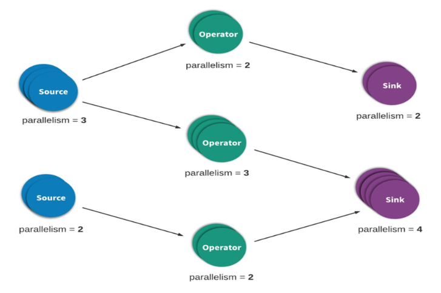

流处理引擎通常为应用程序提供了三种数据处理语义：最多一次、至少一次和精确一次。

如下是对这些不同处理语义的宽松定义(一致性由弱到强)：At most noce < At least once < Exactly once < End to End Exactly once

### At-most-once-最多一次

有可能会有数据丢失。这本质上是简单的恢复方式，也就是直接从失败处的下个数据开始恢复程序，之前的失败数据处理就不管了。可以保证数据或事件最多由应用程序中的所有算子处理一次。这意味着如果数据在被流应用程序完全处理之前发生丢失，则不会进行其他重试或者重新发送。

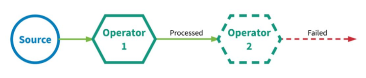

### At-least-once-至少一次

有可能重复处理数据。应用程序中的所有算子都保证数据或事件至少被处理一次。这通常意味着如果事件在流应用程序完全处理之前丢失，则将从源头重放或重新传输事件。然而，由于事件是可以被重传的，因此一个事件有时会被处理多次(至少一次)，至于有没有重复数据，不会关心，所以这种场景需要人工干预自己处理重复数据。

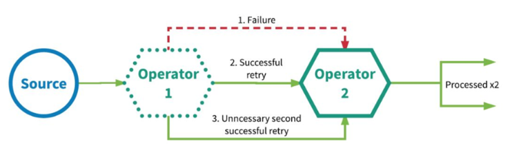

### Exactly-once-精确一次

Exactly-Once 是 Flink、Spark 等流处理系统的核心特性之一，这种语义会保证每一条消息只被流处理系统处理一次。即使是在各种故障的情况下，流应用程序中的所有算子都保证事件只会被『精确一次』的处理。

流应用程序中每个算子的所有状态都会定期做 checkpoint。如果是在系统中的任何地方发生失败，每个算子的所有状态都回滚到最新的全局一致 checkpoint 点。在回滚期间，将暂停所有处理。源也会重置为与最近 checkpoint 相对应的正确偏移量。整个流应用程序基本上是回到最近一次的一致状态，然后程序可以从该状态重新启动。

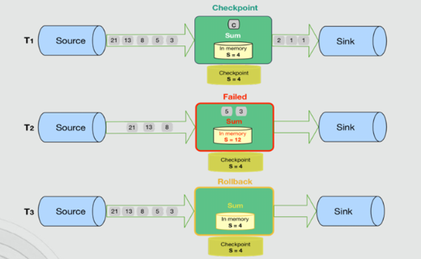

### End-to-End Exactly-Once-端到端的精确一次

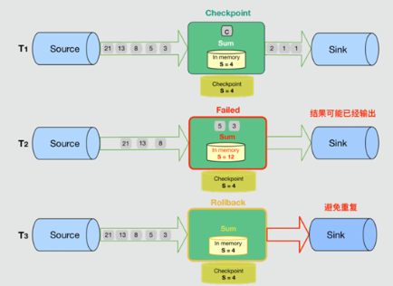

### 精确一次&有效一次

有些人可能认为『精确一次』描述了事件处理的保证，其中流中的每个事件只被处理一次。实际上，没有引擎能够保证正好只处理一次。在面对任意故障时，不可能保证每个算子中的用户定义逻辑在每个事件中只执行一次，因为用户代码被部分执行的可能性是永远存在的。
那么，当引擎声明『精确一次』处理语义时，它们能保证什么呢？如果不能保证用户逻辑只执行一次，那么什么逻辑只执行一次？**当引擎声明『精确一次』处理语义时，它们实际上是在说，它们可以保证引擎管理的状态更新只提交一次到持久的后端存储。**
**事件的处理可以发生多次，但是该处理的效果只在持久后端状态存储中反映一次。**因此，我们认为有效地描述这些处理语义最好的术语是『有效一次』（effectively once）。

### 流计算系统如何支持一致性语义

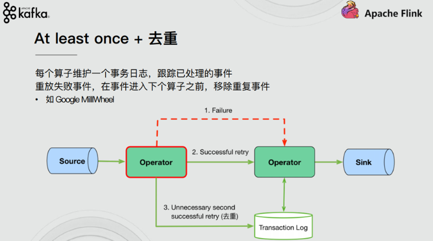

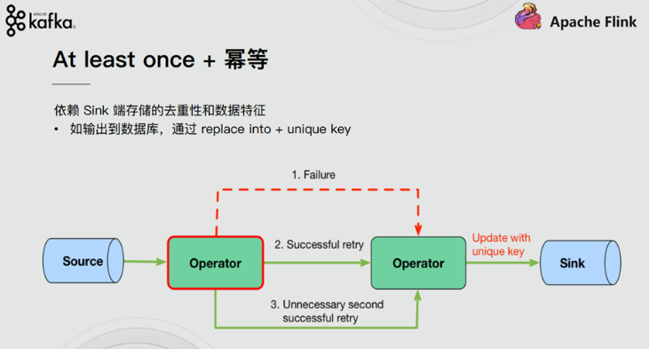

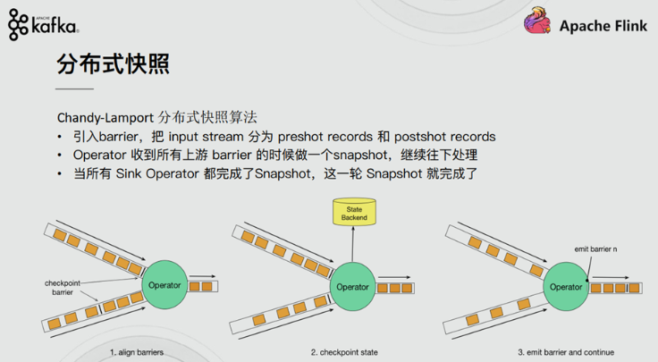

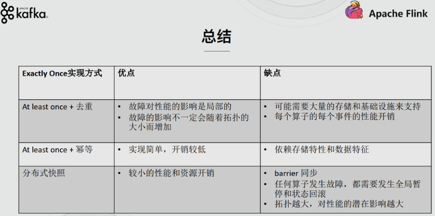
