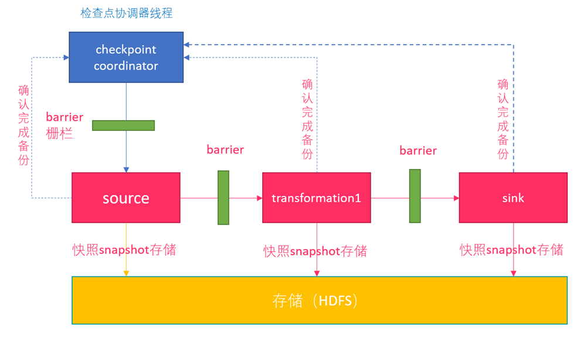
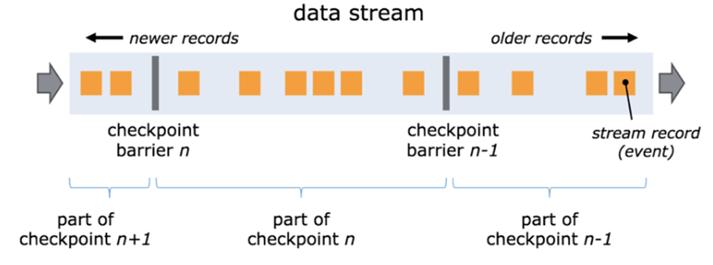
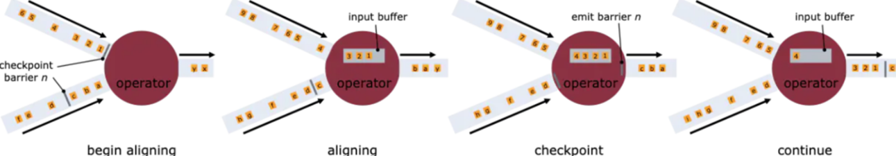
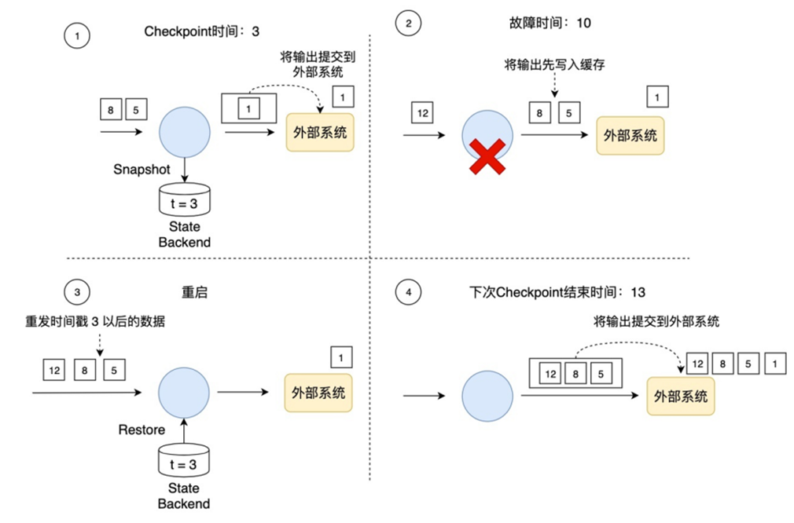
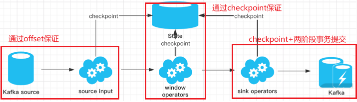
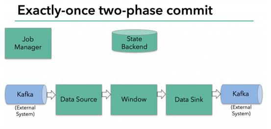
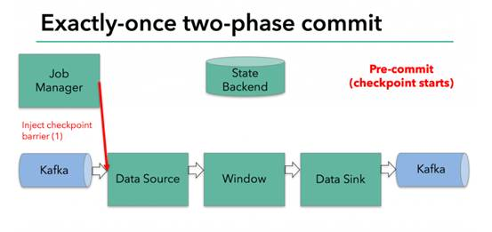
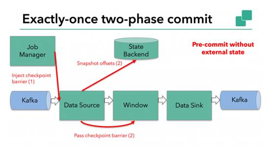
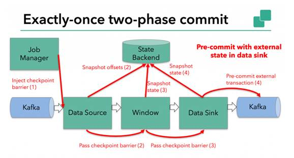
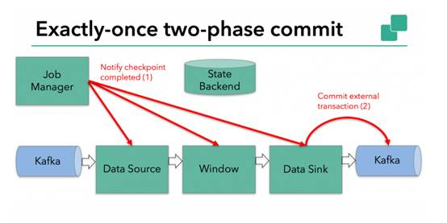

# Flink 高级特性-day2

## End-to-End Exactly-Once的实现

Flink内部借助分布式快照Checkpoint已经实现了内部的Exactly-Once，但是Flink 自身是无法保证外部其他系统“精确一次”语义的，所以 Flink 若要实现所谓“端到端（End to End）的精确一次”的要求，那么外部系统必须支持“精确一次”语义；然后借助一些其他手段才能实现。

### Source

发生故障时需要支持重设数据的读取位置，如Kafka可以通过offset来实现（其他的没有offset系统，我们可以自己实现累加器计数）

### Transformation

Flink内部，已经通过Checkpoint保证了，如果发生故障或出错时，Flink应用重启后会从最新成功完成的checkpoint中恢复——重置应用状态并回滚状态到checkpoint中输入流的正确位置，之后再开始执行数据处理，就好像该故障或崩溃从未发生过一般。

#### 分布式快照机制

Flink 提供了失败恢复的容错机制，而这个容错机制的核心就是持续创建分布式数据流的快照来实现。



同Spark 相比，Spark 仅仅是针对 Driver 的故障恢复 Checkpoint。而 Flink 的快照可以到算子级别，并且对全局数据也可以做快照。

#### Barrier

Flink 分布式快照的核心元素之一是 Barrier（数据栅栏），可以把 Barrier 简单地理解成一个标记，该标记是严格有序的，并且随着数据流往下流动。每个 Barrier 都带有自己的 ID，Barrier 极其轻量，并不会干扰正常的数据处理。



如上图所示，假如有一个从左向右流动的数据流，Flink 会依次生成 snapshot 1、 snapshot 2、snapshot 3……Flink 中有一个专门的“协调者”负责收集每个 snapshot 的位置信息，这个“协调者”（JobManager）也是高可用的。

Barrier 会随着正常数据继续往下流动，每当遇到一个算子，算子会插入一个标识，这个标识的插入时间是上游所有的输入流都接收到 snapshot n。与此同时，当我们的 sink 算子接收到所有上游流发送的 Barrier 时，那么就表明这一批数据处理完毕，Flink 会向“协调者”发送确认消息，表明当前的 snapshot n 完成了。当所有的 sink 算子都确认这批数据成功处理后，那么本次的 snapshot 被标识为完成。

**一旦下游的所有算子都收到并处理完 Barrier，它们会通知 `JobManager` 当前的 `Checkpoint` 已完成。如果所有的算子都报告成功，那么 `JobManager` 就会记录这个 `Checkpoint` 为一个有效的快照。**

这里有一个问题，因为 Flink 运行在分布式环境中，一个 operator 的上游会有很多流，每个流的 barrier n 到达的时间不一致怎么办？这里 Flink 采取的措施是：快流等慢流。



一个流到的早，其他的流到的比较晚。当第一个 barrier n到来后，当前的 operator 会继续等待其他流的 barrier n。直到所有的barrier n 到来后，operator 才会把所有的数据向下发送。

#### 异步和增量

每次在把快照存储到我们的状态后端时，如果是同步进行就会阻塞正常任务，从而引入延迟。因此 Flink 在做快照存储时，可采用异步方式。

此外，由于 checkpoint 是一个全局状态，用户保存的状态可能非常大，多数达 G 或者 T 级别。在这种情况下，checkpoint 的创建会非常慢，而且执行时占用的资源也比较多，因此 Flink 提出了增量快照的概念。也就是说，第一次全量checkpoint，其他每次都是进行的增量 checkpoint，是基于上次进行更新的。

### Sink

需要支持幂等写入/事务写入(Flink的两阶段提交需要事务支持)

#### 幂等写入（Idempotent Writes）

幂等写操作是指：任意多次向一个系统写入数据，只对目标系统产生一次结果影响。
例如，重复向一个HashMap里插入同一个Key-Value二元对，第一次插入时这个HashMap发生变化，后续的插入操作不会改变HashMap的结果，这就是一个幂等写操作。HBase、Redis和Cassandra这样的KV数据库一般经常用来作为Sink，用以实现端到端的Exactly-Once。

#### 事务写入（Transactional Writes）

Flink借鉴了数据库中的事务处理技术，同时结合自身的Checkpoint机制来保证Sink只对外部输出产生一次影响。大致的流程如下:
Flink先将待输出的数据保存下来暂时不向外部系统提交，等到Checkpoint结束时，Flink上下游所有算子的数据都是一致的时候，Flink将之前保存的数据全部提交（Commit）到外部系统。换句话说，只有经过Checkpoint确认的数据才向外部系统写入。

如下图所示，如果使用事务写，那只把时间戳3之前的输出提交到外部系统，时间戳3以后的数据（例如时间戳5和8生成的数据）暂时保存下来，等待下次Checkpoint时一起写入到外部系统。这就避免了时间戳5这个数据产生多次结果，多次写入到外部系统。



在事务写的具体实现上，Flink目前提供了两种方式：

**1、** 预写日志（Write-Ahead-Log，WAL）：WAL方式通用性更强，适合几乎所有外部系统，但也不能提供百分百端到端的Exactly-Once，因为WAL预习日志会先写内存，而内存是易失介质
**2、** 两阶段提交（Two-Phase-Commit，2PC）：如果外部系统自身就支持事务（比如MySQL、Kafka），可以使用2PC方式，可以提供百分百端到端的Exactly-Once

## Flink+Kafka的End-to-End Exactly-Once

### 两阶段提交-API

在Flink 中的Two-Phase-Commit-2PC两阶段提交的实现方法被封装到了TwoPhaseCommitSinkFunction 这个抽象类中，只需要实现其中的beginTransaction、preCommit、commit、abort 四个方法就可以实现“精确一次”的处理语义，如FlinkKafkaProducer就实现了该类并实现了这些方法。

**1、** beginTransaction，在开启事务之前，我们在目标文件系统的临时目录中创建一个临时文件，后面在处理数据时将数据写入此文件；
**2、** preCommit，在预提交阶段，刷写（flush）文件，然后关闭文件，之后就不能写入到文件了，我们还将为属于下一个检查点的任何后续写入启动新事务；
**3、** commit，在提交阶段，我们将预提交的文件原子性移动到真正的目标目录中，请注意，这会增加输出数据可见性的延迟；
**4、** abort，在中止阶段，我们删除临时文件；

### 两阶段提交-简单流程



1.一旦 Flink 开始做 checkpoint 操作，那么就会进入 pre-commit “预提交”阶段，同时JobManager的Coordinator 会将 Barrier 注入数据流中 ；

2.当所有的 barrier 在算子中成功进行一遍传递(就是Checkpoint完成)，并完成快照后，则“预提交”阶段完成；

3.等所有的算子完成“预提交”，就会发起一个commit“提交”动作，但是任何一个“预提交”失败都会导致 Flink 回滚到最近的 checkpoint；

### 两阶段提交-详细流程



在上图中，有：

– 从Kafka读取的数据源（Flink内置的[KafkaConsumer](https://ci.apache.org/projects/flink/flink-docs-release-1.4/dev/connectors/kafka.html#kafka-consumer)）

– 窗口聚合

– 将数据写回Kafka的数据输出端（Flink内置的[KafkaProducer](https://ci.apache.org/projects/flink/flink-docs-release-1.4/dev/connectors/kafka.html#kafka-producer)）

要使数据输出端提供Exactly-Once保证，它必须将所有数据通过一个事务提交给Kafka。提交捆绑了两个checkpoint之间的所有要写入的数据。这可确保在发生故障时能回滚写入的数据。

但是在分布式系统中，通常会有多个并发运行的写入任务的，简单的提交或回滚是不够的，因为所有组件必须在提交或回滚时“一致”才能确保一致的结果。

Flink使用两阶段提交协议及预提交阶段来解决这个问题。

**l .预提交-内部状态**

在checkpoint开始的时候，即两阶段提交协议的“预提交”阶段。当checkpoint开始时，Flink的JobManager会将checkpoint barrier（将数据流中的记录分为进入当前checkpoint与进入下一个checkpoint）注入数据流。

brarrier在operator之间传递。对于每一个operator，它触发operator的状态快照写入到state backend。



数据源保存了消费Kafka的偏移量(offset)，之后将checkpoint barrier传递给下一个operator。

这种方式仅适用于operator具有『内部』状态。所谓内部状态，是指Flink state backend保存和管理的 -例如，第二个operator中window聚合算出来的sum值。当一个进程有它的内部状态的时候，除了在checkpoint之前需要将数据变更写入到state backend，不需要在预提交阶段执行任何其他操作。[Flink](https://zhoukaibo.com/tags/flink/)负责在checkpoint成功的情况下正确提交这些写入，或者在出现故障时中止这些写入。



 

**l .预提交-外部状态**

但是，当进程具有『外部』状态时，需要作些额外的处理。外部状态通常以写入外部系统（如Kafka）的形式出现。在这种情况下，为了提供Exactly-Once保证，外部系统必须支持事务，这样才能和两阶段提交协议集成。

在该示例中的数据需要写入Kafka，因此数据输出端（Data Sink）有外部状态。在这种情况下，在预提交阶段，除了将其状态写入state backend之外，数据输出端还必须预先提交其外部事务。



当checkpoint barrier在所有operator都传递了一遍，并且触发的checkpoint回调成功完成时，预提交阶段就结束了。所有触发的状态快照都被视为该checkpoint的一部分。checkpoint是整个应用程序状态的快照，包括预先提交的外部状态。如果发生故障，我们可以回滚到上次成功完成快照的时间点。

**2.提交阶段**

下一步是通知所有operator，checkpoint已经成功了。这是两阶段提交协议的提交阶段，JobManager为应用程序中的每个operator发出checkpoint已完成的回调。

数据源和widnow operator没有外部状态，因此在提交阶段，这些operator不必执行任何操作。但是，数据输出端（Data Sink）拥有外部状态，此时应该提交外部事务。



**总结**

1.一旦所有operator完成预提交，就提交一个commit。

2.如果只要有一个预提交失败，则所有其他提交都将中止，我们将回滚到上一个成功完成的checkpoint。

3.在预提交成功之后，提交的commit需要保证最终成功 – operator和外部系统都需要保障这点。如果commit失败（例如，由于间歇性网络问题），整个[Flink](https://zhoukaibo.com/tags/flink/)应用程序将失败，应用程序将根据用户的重启策略重新启动，还会尝试再提交。这个过程至关重要，因为如果commit最终没有成功，将会导致数据丢失。

### 代码实现

```java
package com.hzy.advfeatures;
import org.apache.commons.lang3.SystemUtils;
import org.apache.flink.api.common.functions.FlatMapFunction;
import org.apache.flink.api.common.functions.RichMapFunction;
import org.apache.flink.api.common.restartstrategy.RestartStrategies;
import org.apache.flink.api.common.serialization.SimpleStringSchema;
import org.apache.flink.api.common.time.Time;
import org.apache.flink.api.java.tuple.Tuple;
import org.apache.flink.api.java.tuple.Tuple2;
import org.apache.flink.runtime.state.filesystem.FsStateBackend;
import org.apache.flink.streaming.api.CheckpointingMode;
import org.apache.flink.streaming.api.datastream.DataStreamSource;
import org.apache.flink.streaming.api.datastream.KeyedStream;
import org.apache.flink.streaming.api.datastream.SingleOutputStreamOperator;
import org.apache.flink.streaming.api.environment.CheckpointConfig;
import org.apache.flink.streaming.api.environment.StreamExecutionEnvironment;
import org.apache.flink.streaming.connectors.kafka.FlinkKafkaConsumer;
import org.apache.flink.streaming.connectors.kafka.FlinkKafkaProducer;
import org.apache.flink.streaming.connectors.kafka.internals.KeyedSerializationSchemaWrapper;
import org.apache.flink.util.Collector;

import java.util.Properties;
import java.util.Random;
import java.util.concurrent.TimeUnit;

/**
 * Desc
 * Kafka --> Flink-->Kafka  的End-To-End-Exactly-once
 * 直接使用
 * FlinkKafkaConsumer  +  Flink的Checkpoint  +  FlinkKafkaProducer
 */
public class Kafka_Flink_Kafka_EndToEnd_ExactlyOnce {
    public static void main(String[] args) throws Exception {
        //1.env
        StreamExecutionEnvironment env = StreamExecutionEnvironment.getExecutionEnvironment();
        //===========Checkpoint参数设置====
        //===========类型1:必须参数=============
        //设置Checkpoint的时间间隔为1000ms做一次Checkpoint/其实就是每隔1000ms发一次Barrier!
        env.enableCheckpointing(1000);
        //设置State状态存储介质
        if (SystemUtils.IS_OS_WINDOWS) {
            env.setStateBackend(new FsStateBackend("file:///D:/ckp"));
        } else {
            env.setStateBackend(new FsStateBackend("hdfs://node1:8020/flink-checkpoint/checkpoint"));
        }
        //===========类型2:建议参数===========
        //设置两个Checkpoint 之间最少等待时间,如设置Checkpoint之间最少是要等 500ms(为了避免每隔1000ms做一次Checkpoint的时候,前一次太慢和后一次重叠到一起去了)
        //如:高速公路上,每隔1s关口放行一辆车,但是规定了两车之前的最小车距为500m
        env.getCheckpointConfig().setMinPauseBetweenCheckpoints(500);//默认是0
        //设置如果在做Checkpoint过程中出现错误，是否让整体任务失败：true是  false不是
        //env.getCheckpointConfig().setFailOnCheckpointingErrors(false);//默认是true
        env.getCheckpointConfig().setTolerableCheckpointFailureNumber(10);//默认值为0，表示不容忍任何检查点失败
        //设置是否清理检查点,表示 Cancel 时是否需要保留当前的 Checkpoint，默认 Checkpoint会在作业被Cancel时被删除
        //ExternalizedCheckpointCleanup.DELETE_ON_CANCELLATION：true,当作业被取消时，删除外部的checkpoint(默认值)
        //ExternalizedCheckpointCleanup.RETAIN_ON_CANCELLATION：false,当作业被取消时，保留外部的checkpoint
        env.getCheckpointConfig().enableExternalizedCheckpoints(CheckpointConfig.ExternalizedCheckpointCleanup.RETAIN_ON_CANCELLATION);

        //===========类型3:直接使用默认的即可===============
        //设置checkpoint的执行模式为EXACTLY_ONCE(默认)
        env.getCheckpointConfig().setCheckpointingMode(CheckpointingMode.EXACTLY_ONCE);
        //设置checkpoint的超时时间,如果 Checkpoint在 60s内尚未完成说明该次Checkpoint失败,则丢弃。
        env.getCheckpointConfig().setCheckpointTimeout(60000);//默认10分钟
        //设置同一时间有多少个checkpoint可以同时执行
        env.getCheckpointConfig().setMaxConcurrentCheckpoints(1);//默认为1

        //=============重启策略===========
        env.setRestartStrategy(RestartStrategies.fixedDelayRestart(3, Time.of(10, TimeUnit.SECONDS)));

        //2.Source
        Properties props_source = new Properties();
        props_source.setProperty("bootstrap.servers", "node1:9092");
        props_source.setProperty("group.id", "flink");
        props_source.setProperty("auto.offset.reset", "latest");
        props_source.setProperty("flink.partition-discovery.interval-millis", "5000");//会开启一个后台线程每隔5s检测一下Kafka的分区情况
        //props_source.setProperty("enable.auto.commit", "true");//没有Checkpoint的时候使用自动提交偏移量到默认主题:__consumer_offsets中
        //props_source.setProperty("auto.commit.interval.ms", "2000");
        //kafkaSource就是KafkaConsumer
        FlinkKafkaConsumer<String> kafkaSource = new FlinkKafkaConsumer<>("flink_kafka", new SimpleStringSchema(), props_source);
        kafkaSource.setStartFromLatest();
        //kafkaSource.setStartFromGroupOffsets();//设置从记录的offset开始消费,如果没有记录从auto.offset.reset配置开始消费
        //kafkaSource.setStartFromEarliest();//设置直接从Earliest消费,和auto.offset.reset配置无关
        kafkaSource.setCommitOffsetsOnCheckpoints(true);//执行Checkpoint的时候提交offset到Checkpoint(Flink用),并且提交一份到默认主题:__consumer_offsets(外部其他系统想用的话也可以获取到)
        DataStreamSource<String> kafkaDS = env.addSource(kafkaSource);

        //3.Transformation
        //3.1切割出每个单词并直接记为1
        SingleOutputStreamOperator<Tuple2<String, Integer>> wordAndOneDS = kafkaDS.flatMap(new FlatMapFunction<String, Tuple2<String, Integer>>() {
            @Override
            public void flatMap(String value, Collector<Tuple2<String, Integer>> out) throws Exception {
                //value就是每一行
                String[] words = value.split(" ");
                for (String word : words) {
                    Random random = new Random();
                    int i = random.nextInt(5);
                    if (i > 3) {
                        System.out.println("出bug了...");
                        throw new RuntimeException("出bug了...");
                    }
                    out.collect(Tuple2.of(word, 1));
                }
            }
        });
        //3.2分组
        //注意:批处理的分组是groupBy,流处理的分组是keyBy
        KeyedStream<Tuple2<String, Integer>, Tuple> groupedDS = wordAndOneDS.keyBy(0);
        //3.3聚合
        SingleOutputStreamOperator<Tuple2<String, Integer>> aggResult = groupedDS.sum(1);
        //3.4将聚合结果转为自定义的字符串格式
        SingleOutputStreamOperator<String> result = (SingleOutputStreamOperator<String>) aggResult.map(new RichMapFunction<Tuple2<String, Integer>, String>() {
            @Override
            public String map(Tuple2<String, Integer> value) throws Exception {
                return value.f0 + ":::" + value.f1;
            }
        });

        //4.sink
        //result.print();
        Properties props_sink = new Properties();
        props_sink.setProperty("bootstrap.servers", "node1:9092");
        props_sink.setProperty("transaction.timeout.ms", 1000 * 5 + "");//设置事务超时时间，也可在kafka配置中设置
        /*FlinkKafkaProducer<String> kafkaSink0 = new FlinkKafkaProducer<>(
                "flink_kafka",
                new SimpleStringSchema(),
                props_sink);*/
        FlinkKafkaProducer<String> kafkaSink = new FlinkKafkaProducer<>(
                "flink_kafka2",
                new KeyedSerializationSchemaWrapper<String>(new SimpleStringSchema()),
                props_sink,
                FlinkKafkaProducer.Semantic.EXACTLY_ONCE
        );
        result.addSink(kafkaSink);

        //5.execute
        env.execute();
        //测试
        //1.创建主题 /export/server/kafka/bin/kafka-topics.sh --zookeeper node1:2181 --create --replication-factor 2 --partitions 3 --topic flink_kafka2
        //2.开启控制台生产者 /export/server/kafka/bin/kafka-console-producer.sh --broker-list node1:9092 --topic flink_kafka
        //3.开启控制台消费者 /export/server/kafka/bin/kafka-console-consumer.sh --bootstrap-server node1:9092 --topic flink_kafka2
    }
}
```
