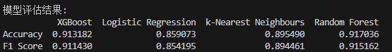
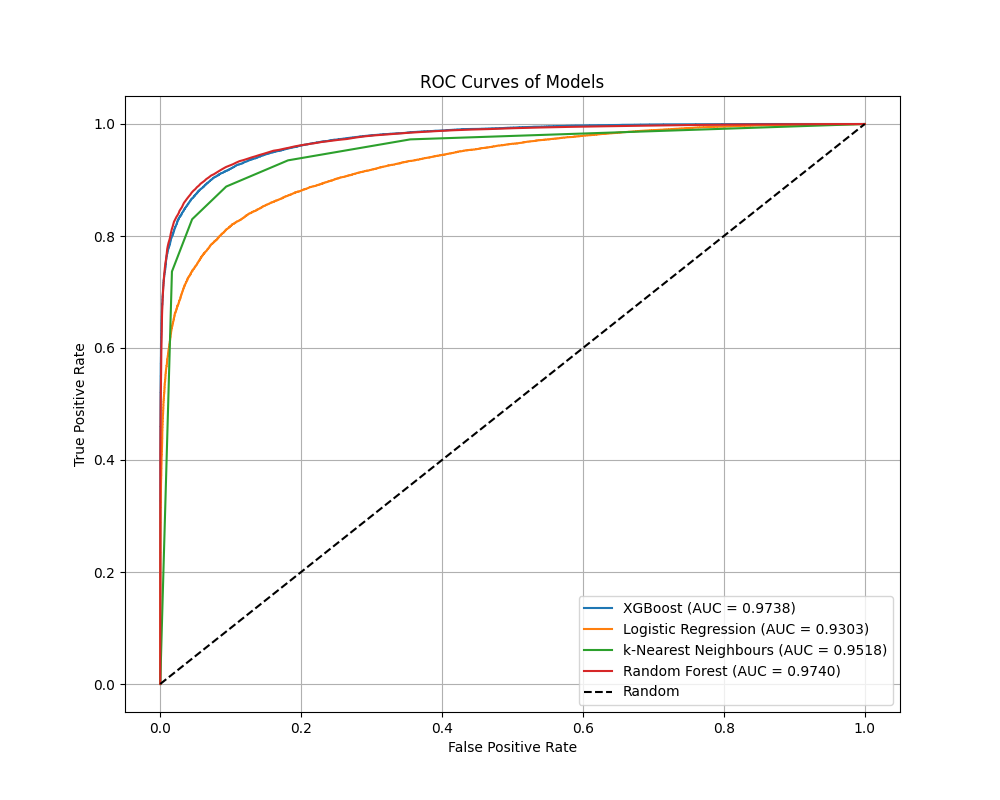

# DGA检测

**日报：**

1.修改代码分批处理数据集

​	原始数据集有240000行，通过n-grams提取特征后生成24000*50555的矩阵，模型加载时是一次性读入内存，导致内存不足，所以改为分批处理。-----代码更新至DGA代码文件夹

 2.整理pip依赖：requirements.txt文件中补充依赖对应版本

​	分批处理时xgboost和scikit-learn版本冲突

识别结果：



ROC曲线：



# 基于域名特征的DGA检测机器学习模型（二分类）

## 目录

1. [项目概述](#项目概述)
2. [环境与依赖](#环境与依赖)
3. [数据加载与预处理](#数据加载与预处理)
4. 特征工程
   - [自定义特征提取](#自定义特征提取)
   - [n-gram特征提取](#ngram特征提取)
5. 模型训练与评估
   - [数据划分与标准化](#数据划分与标准化)
   - [模型定义与训练](#模型定义与训练)
   - [模型评估与ROC曲线绘制](#模型评估与roc曲线绘制)
6. [模型保存与持久化](#模型保存与持久化)
7. [内存管理与优化](#内存管理与优化)

------

## 项目概述

本项目旨在通过机器学习技术检测域名生成算法（DGA）生成的恶意域名。通过提取域名的多种特征，包括自定义统计特征和n-gram特征，构建分类模型以区分正常域名和DGA域名。使用多种分类算法（如XGBoost、逻辑回归、k-NN和随机森林）进行训练和评估，最终保存最佳模型用于实际应用。

## 环境与依赖

### 编程语言与版本

- Python 3.12.8
- 

### 主要库

- 数据处理：`numpy`, `pandas`
- 可视化：`matplotlib`, `seaborn`
- 文本特征提取：`re`, `sklearn.feature_extraction.text.TfidfVectorizer`
- 机器学习：`sklearn`（包含模型选择、评估、预处理等模块），`xgboost`
- 统计分析：`scipy.stats`
- 持久化：`joblib`
- 内存管理：`gc`

### 安装依赖

```
pip install -r requirements.txt
```

​	依赖版本：

```
pandas==2.2.3
numpy==2.0.2
matplotlib==3.10.0
scikit-learn==1.5.2
seaborn==0.13.2
xgboost==1.7.1
joblib==1.4.2
tensorflow==2.18.0
python-multipart==0.0.20
jinja2==3.1.4
fastapi ==0.115.6
uvicorn==0.34.0
```

## 数据加载与预处理

### 数据读取

- 数据文件路径
- 使用`pandas.read_csv`读取CSV文件
- 数据集包含至少两列：`Domain`（域名）和`Target`（标签，区分正常与DGA域名）

### 数据打乱

- 使用`df.sample(frac=1, random_state=42).reset_index(drop=True)`打乱数据顺序，确保训练过程中的随机性和模型的泛化能力。

### 列选择

- 仅保留`Domain`和`Target`两列，去除其他可能存在的无关列。

## 特征工程

包括自定义特征和n-gram特征的提取

### 自定义特征提取

#### 特征定义

针对每个域名提取以下自定义特征：

1. **N**：子域名数量（包括主域和顶级域）。
2. **LCc**：域名中最长连续辅音的长度。
3. **LCv**：域名中最长连续元音的长度。
4. **LCn**：域名中最长连续数字的长度。
5. **L_tld**：顶级域名长度。
6. **Rc_tld**：顶级域名中辅音比例。
7. **Rv_tld**：顶级域名中元音比例。
8. **Rn_tld**：顶级域名中数字比例。
9. **Rl_tld**：顶级域名中字母比例。
10. **Rs_tld**：顶级域名中符号比例。
11. **L_sld** 至 **Rs_sub**：同上，但分别针对二级域名（SLD）和子域名。

#### 实现步骤

1. **域名分割**：将域名按`.`分割为子域名、二级域名（SLD）和顶级域名（TLD）。
2. 统计字符类型
   - 辅音数、元音数、数字数、符号数。
   - 计算各类字符的比例。
3. 提取最长连续序列
   - 使用正则表达式提取辅音、元音和数字的最长连续序列长度。
4. 数据整合
   - 将所有特征整合为一个DataFrame，并与原数据拼接。

### n-gram特征提取

#### 特征定义

使用字符级n-gram（1-gram、2-gram、3-gram）进行特征提取，并计算每个n-gram的统计特征：

- **DIST**：非零元素（存在的n-gram数量）。
- **MEAN**：n-gram频率均值。
- **QMEAN**：n-gram频率的平方根均值。
- **SUMSQ**：n-gram频率的平方和。
- **VAR**、**PVAR**：方差（样本方差与总体方差）。
- **STD**、**PSTD**：标准差（样本标准差与总体标准差）。
- **SKE**：偏度（数据量大于2时计算）。
- **KUR**：峰度（数据量大于3时计算）。

#### 实现步骤

1. 向量器创建与拟合
   - 使用`TfidfVectorizer`分别创建单字、双字和三字的向量器，限制最大特征数量为1000。
   - 在整个数据集上拟合向量器。
2. 批量处理
   - 由于数据量可能较大，采用分批处理方式（每批10000条）提取n-gram特征。
3. 统计特征计算
   - 对每个样本的n-gram矩阵进行统计特征计算，生成对应的特征DataFrame。
4. 特征合并
   - 将单字、双字和三字的特征进行合并，得到最终的n-gram特征集。

## 模型训练与评估

### 数据划分与标准化

1. 特征与标签分离
   - 特征集`X`：去除`Domain`和`Target`列。
   - 标签集`y`：`Target`列。
2. 训练集与测试集划分
   - 使用`train_test_split`按80:20比例划分，采用分层抽样`stratify=y`以保持类别分布一致。
3. 数据标准化
   - 使用`StandardScaler`对特征进行标准化，适用于大多数机器学习模型。

### 模型定义与训练

1. 模型选择
   - **XGBoost**：`xgb.XGBClassifier`，设置评估指标为`mlogloss`，禁用标签编码器，设定随机种子。
   - **逻辑回归**：`LogisticRegression`，设定最大迭代次数为1000。
   - **k-最近邻**：`KNeighborsClassifier`，设定邻居数量为5。
   - **随机森林**：`RandomForestClassifier`，设定随机种子。
2. 交叉验证
   - 使用`StratifiedKFold`进行5折交叉验证，评估指标为准确率和F1分数。
3. 模型训练
   - 在训练集上训练每个模型，并在测试集上进行预测。

### 模型评估与ROC曲线绘制

1. 性能指标
   - **准确率（Accuracy）**：预测正确的比例。
   - **F1分数（F1 Score）**：调和平均数，综合考虑精确率和召回率。
   - **ROC AUC**：接收者操作特征曲线下面积，衡量模型区分能力。
2. ROC曲线绘制
   - 对每个模型计算FPR（假正率）和TPR（真正率），绘制ROC曲线。
   - 添加随机模型对比线（对角线）。
3. 结果展示
   - 打印每个模型的准确率、F1分数和ROC AUC。
   - 展示ROC曲线图。

## 模型保存与持久化

1. 向量器与标准化器保存
   - 使用`joblib.dump`将单字、双字、三字向量器和`StandardScaler`保存为`.pkl`文件，便于后续加载和使用。
2. 模型保存
   - 示例中仅保存了XGBoost模型，其他模型可根据需要进行保存。

## 内存管理与优化

- 垃圾回收
  - 使用`gc.collect()`在批处理和内存占用较大的步骤后进行垃圾回收，释放内存。
- 数据分批处理
  - 对n-gram特征进行分批处理，避免一次性加载过多数据导致内存溢出。
